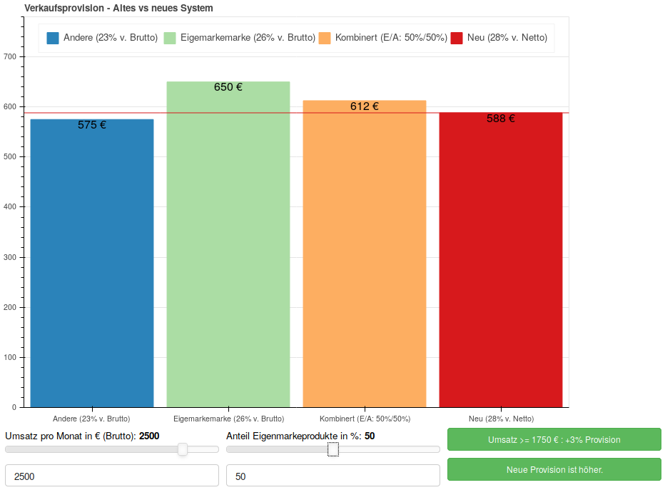

# Testing functionality of slider callbacks in interaction with text callbacks at hand of a use case comparing two different commission systems.

## Requirements
Python3 and pip. Install python packages using
`pip install -r requirements.txt`

## Using
To obtain an overview over the preference of the old vs new comission system, run
`python bars.py`, which will output a pdf file in folder `doc`.

Running an interactive bokeh server which allows for playing around with the data a bit, run
`bokeh serve bars.py`

